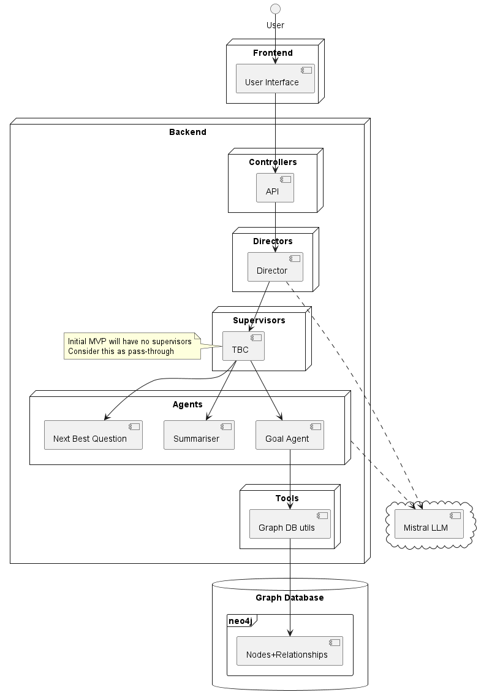

# Goal Bot

## Introduction

This folder holds documentation and design related to "goal-bot".

This is a very early version of InferGPT that is being used to gradually expand the features supported. When reviewing the intended long-term design, it is recommended to review the top-level [README](../README.md).

### Plant UML

This folder holds Plant UML diagrams. It is recommended to use IDEs with suitable extensions to preview diagrams and generate images.

We recommended the [vscode-plantuml](https://github.com/qjebbs/vscode-plantuml) plug-in for VS Code. This provides support for preview and image generation.

---

## Architecture

High Level Architecture of the initial version of "goal-bot"

> [!NOTE]
> This is work-in-progress and will actively change.

