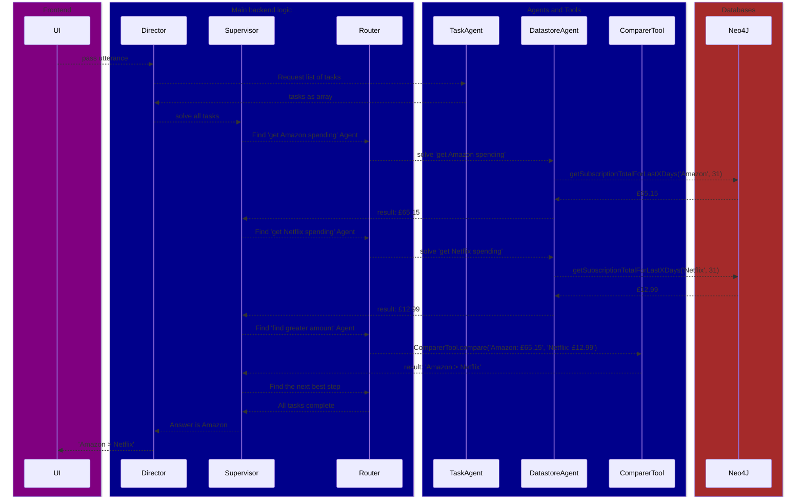

# "What did I spend more on last month, Amazon or Netflix?"

I am a user who wants to know if last month I spent more on my Netflix subscription than my Amazon one

### Find tasks from question
```mermaid
sequenceDiagram
```


