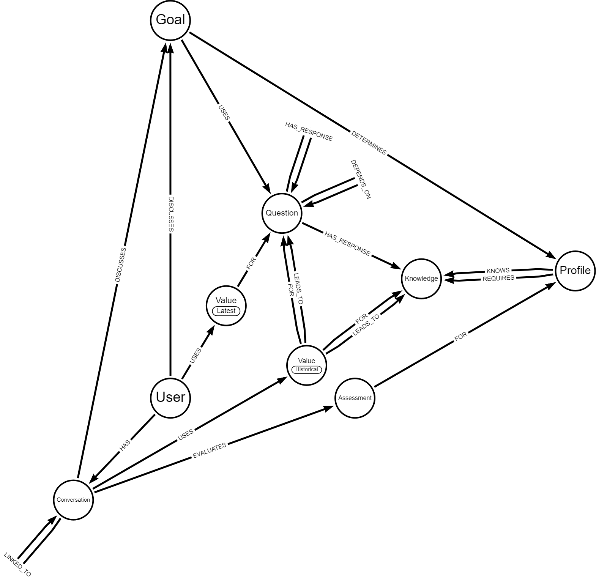

# Graph DB thoughts

**These are initial thoughts related to ongoing learning and experiments. As such, they will change and may be wrong. Please read with this in mind. Feedback is appreciated**

## Proposed knowledge ontology

The graph can be loaded into [Arrows](https://arrows.app) by importing [graph JSON](brain_ontology.json "Knowledge ontology").



### Nodes
The proposed ontology has the following nodes:

* **Assessment** - a summary of the weighted values for a profile for a conversation for a user
    * **Properties:** (These may change as this node isn't used yet nor are the values calculated)
    * total
    * weightedTotal
* **Conversation** - is a specific conversation that the user has had with the chatbot about a goal.
    * **Properties:**
    * conversationId
    * when - date/time conversation started
* **Goal** - is a conversation goal / topic / intent (topic may be a better name, TBD), e.g. "financial health".
    * **Properties:**
    * goalId
    * name
* **Knowledge** - is a final state of a question path (e.g. total savings).
    * **Properties:**
    * knowledgeId
    * name
* **Profile** - a profile summarises the type of user, e.g. "high net worth". A profile is associated with one or more Knowledge nodes (that roughly map to a single line item of the  sample profile, e.g. Mortgage >= £150,000). Knowledge nodes may be shared between Profiles or may be distinct. The assumption is that some unique Knowledge nodes will exist else profiles can become subsets of each other (and should probably be removed if that is the case).
    * **Properties:**
    * profileId
    * name
* **Question** - is a state to be determined. This may be by querying a value elsewhere in the graph or by asking the user (or potentially from other data sources if required). The answer to a question may lead to further questions before terminating as Knowledge (e.g. fetch user's savings balance leads to asking how much in any other savings leads to a query to sum the total of the two savings before terminating as Knowledge being total savings).
    * **Properties:**
    * questionId
    * name - not used but may be useful as question title or similar
    * prompt - user question
    * query - cypher query for Pull questions
    * intent - intent recognition identifier for Prompt questions
    * type - one of Pull, Push, Prompt, or Calculate:
        * Pull - query another system for the value and then write it back to the user graph
        * Push - the value is always the latest (any updates are pushed from outside the conversation system)
        * Prompt - a question to ask a user
        * Calculate - calculate a value using the values it depends
* **User** - is a user of the chatbot system (e.g. a UKRetail bank customer or potential customer).
    * **Properties:**
    * userId
    * name

**NOTE** Questions could form a cycle if misconfigured. In practice, this should be a DAG and any update operations need to ensure that no cycles are created. There will be a single USES relationship from Goal to each 'starting' Question of a DAG that leads via zero or more further Question nodes to one or more Knowledge nodes.

### Relationships
The relationships are as follows:

* **DEPENDS_ON** - used for Calculation Questions to define a dependency on another question. The Value associated with the Questions will be summarised into a map for the calculation to use.
* **DISCUSSES** - links a specific User or Conversation to the conversation Goal.
* **EVALUATES** - a conversation goal attempts to match the user to one of several possible profiles.
* **FOR** - links a Value to the corresponding Question or Knowledge or an Assessment to the corresponding Profile.
* **HAS** - a User has a Conversation.
* **HAS_RESPONSE** - specifies a predicate to check the value against in order to determine how to traverse the question path, e.g. value >= 500 or value is null. There should also be (and possibly must be) a path with no predicate (the default / fall-through path) as we probably need to ensure questions are designed such that they always cover all cases - this hasn't been implemented yet (requires definition and an update to the cypher query / Python code).
    * **Properties:** predicate to test the Value against. If true, the conversation follows that graph path else it blocks the path
* **LEADS_TO** - after evaluating the predicates, links a Value to the next Question or Knowledge on paths where the predicates held (were true).
* **LINKED_TO** - links a conversation with a previous conversation (in order to continue it) or where the user switches goals during a conversation. Values (HAS_VALUE relationships) should be transferred from the linked conversation to the new conversation - this probably means re-querying values (or add a time-to-live / TTL and only re-querying if expired) and confirming values when questioning the user.
* **MAY_FIT** - at the start of a conversation, a MAY_FIT relationship is added for the user for all profiles within a goal. As the questions are asked and question paths ignored as not accessible due to the response values, the MAY_FIT relationships for the corresponding inapplicable profiles are removed.
* **REQUIRES** - a profile is determined by one or more items of Knowledge (which are in turn determined by their related Questions).
* **USES** - a conversation goal has a dependency on all of the questions used to determine profiles (this relationship isn't strictly required but may be helpful to determine the starting questions, TBD).

**TODO Export a visual of the sample graph once some conversations are added and include here**

## Graph database

The proposed ontology provides a number of potential benefits:

1. The chatBot ontology sits alongside the rest of the graph - there is nothing specific to finance / any current schema within it (excluding the concept of a User identity node) - it is generic.
1. The chatBot graph could sit in an entirely separate db instance with only read-only access to the main graph. As long as values can be retrieved, no additional dependencies exist.
1. The concept of a Question could be expanded to retrieving a value from any data source.
1. Conversation history can be stored and manipulated without affecting the master graph. This could allow for what-if / imaginary scenarios (what if I got a raise? what if I paid off my loan quicker?)
1. We can pre-process the data from the brain as part of the query to be fit-for-purpose for the conversational intents (e.g. adding calculated field values such as age or summing transactions for total income/outgoings)
1. The conversational schema can evolve independently from the rest of the schema as long as the ability to query values from the wider schema is maintained

## Question flow

The expected orchestrator flow is as below. Where implemented in code, the detail has been removed (the code is the source of truth). Detail here is still TODO.

1. send greeting.
1. loop infinitely / until closed:

    1. if not in conversation:

        1. fetch goals with only incomplete assessments for the latest conversation for that goal (no incoming LINKED_TO relationship) - This is TODO
        1. ask user what they would like to talk about (conversation goal) or else if there are previous incomplete goals, ask if the user wants to continue the previous goals?
        1. filter language (TODO):

            1. bad language -> warn and re-prompt? strip out?
            1. no issue -> continue.

        1. extract intent into JSON result parameter.
        1. filter intents (TODO):

            1. not supported -> re-prompt.
            1. not allowed -> transfer to human.
            1. supported -> set conversation goal, start conversation.

        1. start conversation using JSON result

    1. else if in a conversation:

        1. store user response(s) (extracted intents and entities) if any and get the next question.

        1. calculate the assessment score (TODO).

        1. if there is a question, prompt the user. We could generate a question using the LLM (see notes below) or use the unmodified question from the graph db (deterministic but possibly more robotic).

        1. if there is no question, get matched assessments (TODO - depends how these are used, maybe use a lower cut-off value):

            1. if there are no assessments, we couldn't help so transfer to human?
            1. Do something with the matched assessments / profiles (TODO - need to decide what this means. It could just be generate some content with LLM using a suitably composed prompt)

## Types of question

There appear to be two types of questions:

1. Deciding - these questions eliminate one or more potential Profiles by invalidating one or paths between the Goal and a Profile (a HAS_RESPONSE predicate along the path evaluates to false). These are identified by a REQUIRES relationship
2. Informing - these questions do not eliminate any Profiles. They are either common to some/all profiles and lead to a shared Knowledge node or else they are specific to a single Profile. These are identified by a KNOWS relationship - TODO

When determining the best question to ask, we prefer Deciding questions, specifically whichever question that leads to the most Knowledge nodes for a Profile. The assumption is that the more distinct Knowledge nodes there are, the more potential a question has to eliminate possible profiles. The quicker invalid profiles are removed (Assessment score is below a threshold value), the fewer questions may need asking to complete a conversation. KNOWS relationships aren't implemented but would allow for continuing a conversation to gather more information where that information isn't required to match a Profile

## How to question

It should be possible to use the LLM to generate appropriate questions for the user by constructing a prompt with specific blocks of text as below:

```
Pre-amble text about being a financial advisor in UK.

Answers to previous questions along the path

Prompt to LLM about what question to ask
```

An example might be something like:

```
You are a UK financial advisor providing financial information to a client for the UK only.

You know the following about the client:

Savings of £1,234
Other savings of £2,345 mentioned previously

Prompt the user to find out how much their other savings is now or for them to confirm that the value that they provided previously is still correct.
```

**NOTE** The question flow above does not talk about the mentioned previously line - this could be a future enhancement where the question query could also return the question response a user supplied to this question during a previous conversation (if available). This could provide a more natural conversation flow as well as speed up the conversation by reusing relevant prior information (but not continuing the previous conversation).

The above text could in theory be provided to the LLM to generate the question to then send to the user.

The benefit of the above is that it may generate a less robotic conversation / question whilst still ensuring that we maintain control.

## Intents

An interesting experiment would be to provide a different prompt to the LLM (maybe Codex rather than GPT3?) that is something like below:

```
Pre-amble text describing needing intent: value extraction into JSON format.

List of known intent names.

Prompt that was supplied to the user (as generated by the LLM above).

Response from the user.
```

For example, this could be something like:

```
Convert the following text into one or more intent: value results in JSON format.

For example, the text:

What is your bank balance?
5000

Would become:

{ intents: [ { "bank balance": 5000 } ] }

Whereas the text:

What is your financial goal?
I want to save for a mortgage but I owe 5000 on my credit card.

Would become:

{ intents: [
        { "financial goal": "mortgage" },
        { "debt": 5000 }
    ]
}

You should restrict the output to only use the following intent names:

financial goal
debt
bank balance
savings

You mentioned previously that you have £5,324 in another savings account. How much do you have in other savings accounts now?
The same amount
```

**NOTE** Although I think the above experiment would be interesting, it is likely to unreliable and we should expect to rely on Intent extraction / Named Entity Recognition using an appropriately trained model / service instead. Time permitting though, it would still be interesting to try this and then run both the LLM 'intent extraction' and standard extraction in parallel and record/compare both results. Due to the potential security issues, any generated JSON should not just be sent to the server - we need to ensure that it is well-formed, contains valid required values and has no extraneous data included.

The current expectation is that we can tag questions with intents so that we end up with two types of intents:

1. Conversational goals - these would start a new conversation.
2. Question intents - these would create a HAS_VALUE relationship for all questions that are tagged with the intent (i.e., have a property with the intent name) for the current conversation.

## Naming

It would be good to agree preferred naming. We currently have the following for which I've suggested some alternatives (please suggest more):

### Nodes

* Goal - Topic - Context - Intent
* Profile
* User - Customer
* Question - Query
* Knowledge - Fact - Result

### Relationships

* DETERMINES - DECIDES
* USES
* HAS_RESPONSE - LEADS_TO
* REQUIRES - NEEDS
* ASKS - DISCUSSES - ASKS_ABOUT
* HAS_VALUE - WITH_VALUE
* IS_ACTIVE - SHOULD_ASK
* MAY_FIT - MAY_MATCH
* FITS - MATCHES
