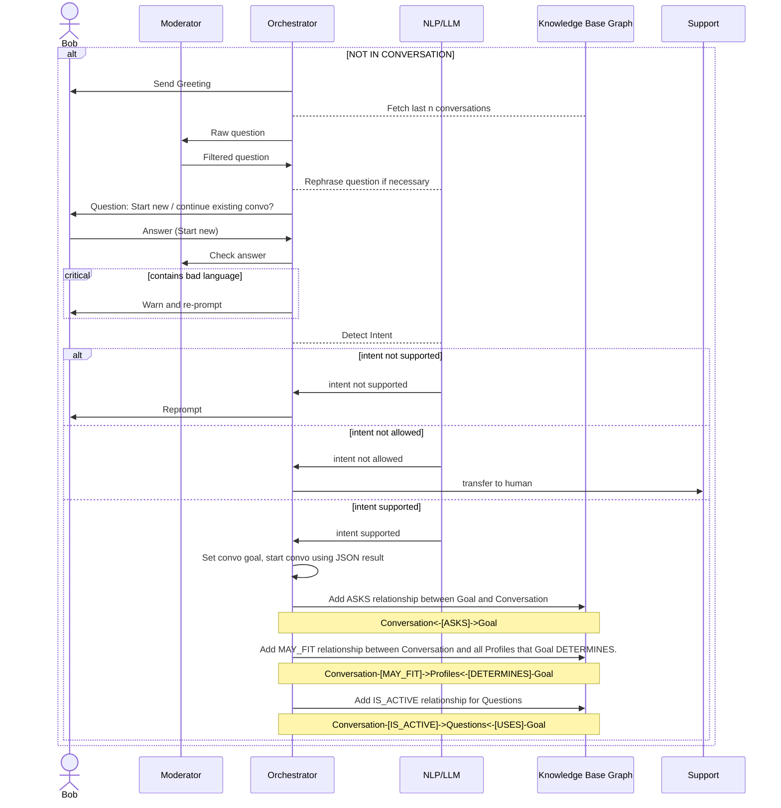

# NOT IN CONVERSATION

```mermaid
sequenceDiagram
%% DRAFT VERSION
%% PLEASE INSTALL RECOMMENDED EXTENSION FOR MERMAID
%% SEE https://mermaid.js.org/syntax/sequenceDiagram.html
%% ALSO https://mermaid.live/
Actor User as Bob
Participant M as Moderator
Participant O as Orchestrator
Participant NLP as NLP/LLM
Participant KB as Knowledge Base Graph
Participant Support as Support

alt NOT IN CONVERSATION
    O ->> User: Send Greeting
    O --> KB: Fetch last n conversations
    O ->> M: Raw question
    M ->> O: Filtered question
    O --> NLP: Rephrase question if necessary
    O ->> User: Question: Start new / continue existing convo?
    User ->> O: Answer (Start new)
    O ->> M: Check answer
    critical contains bad language
        O->>User: Warn and re-prompt
    end
    O --> NLP: Detect Intent
    alt intent not supported
        NLP ->> O: intent not supported
        O ->> User: Reprompt
    else intent not allowed
        NLP ->> O: intent not allowed
        O ->> Support: transfer to human
    else intent supported
        NLP ->> O: intent supported
        O ->> O: Set convo goal, start convo using JSON result
        O ->> KB:  Add ASKS relationship between Goal and Conversation
        Note over O,KB: Conversation<-[ASKS]->Goal
        O ->> KB:  Add MAY_FIT relationship between Conversation and all Profiles that Goal DETERMINES.
        Note over O,KB: Conversation-[MAY_FIT]->Profiles<-[DETERMINES]-Goal
        O ->> KB:  Add IS_ACTIVE relationship for Questions
        Note over O,KB: Conversation-[IS_ACTIVE]->Questions<-[USES]-Goal
    end
end
```

# IN CONVERSATION

```mermaid
sequenceDiagram
%% DRAFT VERSION
Actor User as Bob
Participant M as Moderator
Participant O as Orchestrator
Participant NLP as NLP/LLM
Participant KB as Knowledge Base Graph
Participant Support as Support
alt IN CONVERSATION
    loop infinitely / until closed
        O ->> KB: Fetch the next Question
        Note over O,KB: Fetch Question WHERE  MAX_COUNT(Knowledge)->Question<-[IS_ACTIVE]-Conversation<br>WHERE Knowledge<-[REQUIRES]-Profile<-[MAY_FIT]-Conversation
        alt if question available
            alt if question-query in KB
                O ->> KB: execute query
            else question for the user
                loop Rephrase until Moderator approves / max attempts exhausted
                    O ->> NLP: Template question
                    NLP ->> O: Rephrased question
                    O ->> M: Check question
                    critical question approved
                    M ->> O: break the loop
                    end
                end
                O ->> User: Question
                User ->> O: Answer
                O ->> M: Check answer
                critical contains bad language
                    O->>User: Warn and re-prompt
                end
                O --> NLP: Detect Intent
                alt intent not supported
                    NLP ->> O: intent not supported
                    O ->> User: Reprompt
                else intent not allowed
                    NLP ->> O: intent not allowed
                    O ->> Support: transfer to human
                else intent supported   
                    NLP ->> O: intent supported
                    critical intent is new conversation
                        O->> O: break the global loop / close convo
                    end
                    O ->> KB: store JSON result in Knowledge Base Graph
                    critical  move the IS_ACTIVE relationships that were just answered
                        loop for all questions IS_ACTIVE and HAS_VALUE for this Conversation
                            loop evaluate predicates of all HAS_RESPONSE from question.
                                alt if predicate == True
                                    critical create Conversation-[IS_ACTIVE]->(Question or Knowledge where has [HAS_RESPONSE]) 
                                        alt If [IS_ACTIVE] has a (Node)-[HAS_VALUE]->Question
                                            note over KB: rembember the (Node) as possible cycle
                                            alt if the (Node) is the same as the previous node
                                                note over KB: (i.e. the HAS_RESPONSE links back to itself) 
                                                KB ->> KB: increment the cycle count 
                                                KB ->> KB: fail if it is above some limit TBD.
                                            else keep following the graph
                                                alt A Question / Knowledge node with no HAS_VALUE relationship found
                                                    KB ->> KB: stop following the graph
                                                    note over KB: (this could happen if a user volunteers <br> extra information meaning that they answer questions before we ask them).
                                                else return to the same 'remembered' node
                                                    KB ->> KB: stop following the graph
                                                    note over KB:  meaning that this is a genuine cycle (which should not be possible - <br> question creation should check for this when creating relationships)<br> so fail. (If this is not straightforward, ignore and assume it is prevented<br> at creation time or some post-creation but pre-usage maintenance process).                                            
                                                end
                                            end
                                        end
                                    end
                                end
                            end
                            
                            KB ->> KB: remove the IS_ACTIVE relationships from Question nodes with both IS_ACTIVE and HAS_VALUE for this conversation.
                            KB ->> KB: see the note below
                            note over KB: Perform the Cypher query and update associated with the <br> Knowledge node of any Knowledge nodes that now have an IS_ACTIVE relationship <br> but no HAS_VALUE relationship. The intention here is <br> that the HAS_VALUE relationship of the Knowledge node 'summarizes' the information discovered <br> by the questioning in a form appropriate for subsequent <br> processing / use as part of the Profile. The IS_ACTIVE relationship <br>pointing at Knowledge indicates that this path is complete.
                        end
                    end
                    critical remove any MAY_FIT relationships that are no longer feasible
                        loop for MAY_FIT relationships
                            alt if there is not an IS_ACTIVE relationship for this Conversation from assoc Question
                                KB ->> KB: remove MAY_FIT relationship
                            end
                        end
                        alt if only one MAY_FIT relationship
                            KB ->> KB: change to FITS
                            KB ->> KB: return
                        end
                    end
                end
            end
        else no question or see note below
            note over KB: OR only one MAY_FIT relationship (that became a FITS relationship)
            alt if there are no MAY_FIT relationships
                O ->> Support: transfer to human
            else if there are multiple MAY_FIT relationships
                KB ->> KB: convert all MAY_FIT to FITS relationships
            end
            critical Use the Profiles attached to the FITS relationships
                KB ->> O:  generate appropriate output for the user.
            end
        end
    end
end
```