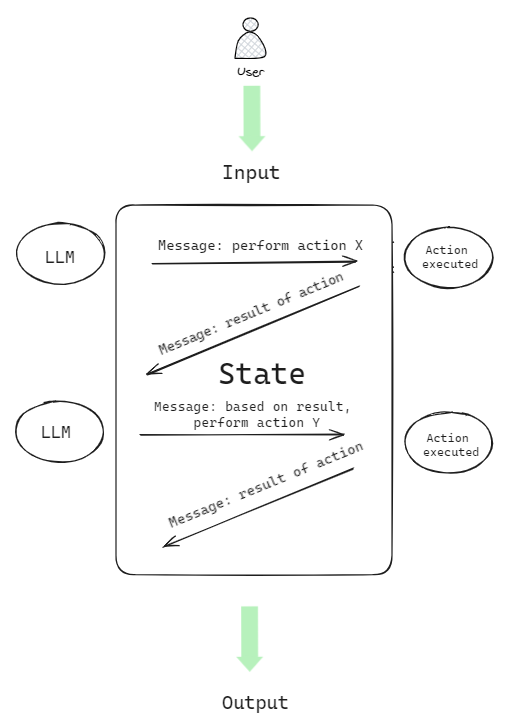
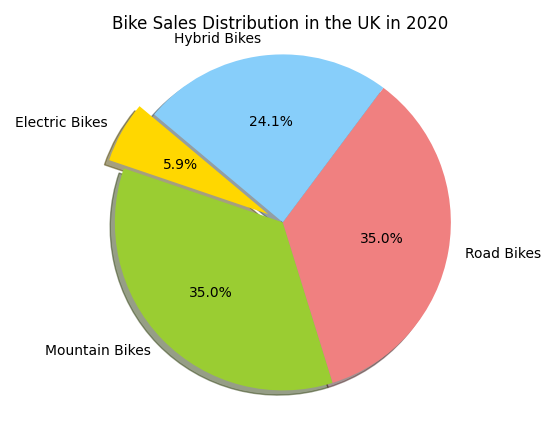
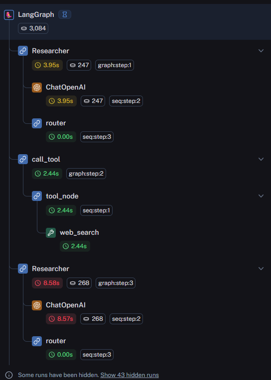

# LangGraph: cycling through multi-agent LLM applications  

While Large Language Models excel at generating answers fast, the latest models are not yet skilled at performing very specific tasks that require more [‘System 2’ thinking](https://blog.langchain.dev/reflection-agents/), the more analytical kind that relies on reflection and self-critique. 

This is where [agents are changing the AI game](https://www.deeplearning.ai/the-batch/issue-241/), bringing action and direction, like a rounded team of highly skilled colleagues, experts in their own field doing what each does best to fulfil a user’s goal or intention. 

While working on an internal AI bot at Scott Logic, I got to explore agentic workflows which naturally led to looking into LangGraph. 

## What is LangGraph? 

LangGraph is a library built on top of [LangChain](https://www.langchain.com/) and is fully compatible with the LangChain ecosystem. 

LangChain for context is an open-source Python and JavaScript framework that abstracts and facilitates interactions between LLMs and external data sources, to create powerful LLM-powered applications. The architecture in LangChain revolves around components and chains, where components perform specific tasks and chains allow you to combine together multiple components in a logical way.

LangGraph differs from LangChain in that it introduces cycles in the workflow, so the model can reflect on itself at each iteration and decide on the best next step, based on the outcome of the previous one. 

There’s a French saying that goes: *tourner sept fois sa langue dans sa bouche avant de parler* (to turn one’s tongue in one’s mouth seven times before speaking), which is often a piece of advice to think long and hard before speaking. Well a cyclic agentic workflow kind of works like that where each iteration brings more reflection and refinement, with the aim of returning a thoroughly informed answer. 


## Core concepts

### State

One of the key concepts in LangGraph is the idea of a state that persists through the workflow, gets passed round from node to node, and that each node edits with its returned value. 

The way it works is we create an AgentState class, and pass in all the messages that each node generates. 



### Nodes

In LangGraph, each specialist agent is a node and the result of its action – its returned value - is passed onto the next one via edges, together with actions needed and observations. 

Nodes can be anything runnable, and each node represents a computation step. They also have access to a set of tools, like a math library, a web scraper, as well as custom tools. Customisation is what's bringing hyper-personalisation to LLM applications, as we feed them the data that matters to us, whether that's our own Strava data or a company's staff portal information.

### Edges

Edges on the other hand are what connects the whole workflow together. They can be hardwired, for example when deciding to return the final response, or conditional, if more work is needed in the workflow. 

Once we have created our nodes and edges, it’s time to build our graph, by creating an instance of the AgentState, and adding our nodes and edges to it. 

## Example

Let's look at the [multi-agent collaboration example from the LangGraph website](https://langchain-ai.github.io/langgraph/tutorials/multi_agent/multi-agent-collaboration/), we'll tweak some of the tools, and the prompt for the sake of the theme:

```python
HumanMessage(
                content="Fetch the number of bikes sold in the UK in 2020,"
                " then draw a circle graph."
                " The graph should display the types of bikes:"
                " mountain bike, road bike, electric bike, and hybrid bike."
                " Once you code it up, finish."
            ) 
```

We've got two nodes:
- a Researcher that has access to Google Search API tools
- a Graph Generator that has at its disposal the Python Repl tool, which can generate Python code.

We also have a Router, which calls functions if the Researcher or the Graph Generator returns that more work is needed to complete a task. 

Let's compile the workflow and observe:

The Researcher gets to work, and starts with a web search:

```python
{'Researcher': {
    'messages': [
        HumanMessage(content='', additional_kwargs={
            'function_call': {
                'arguments': '{
                    "query":"total number of bikes sold in the UK in 2020"}', 'name': 'web_search'}
                    }
        )
        ]
    }
}
```

It gets the total amount of bikes sold, but not broken down into bike types, so in its returned value, the Researcher lets the router know that it needs additional information.

```python
{'Researcher': {
    'messages': [
        HumanMessage(content='The total number of bikes sold in the UK in 2020 was approximately 3.3 million. Now, I will find the breakdown of sales by type of bike (mountain bike, road bike, electric bike, and hybrid bike) to create the circle graph.)
    ]
    }
}
```

Once it has all the information it needs, it provides a message informing on its limits and capabilities:
```python
{'Researcher': {
    'messages': [
        HumanMessage(content="It seems I don't have direct access to a tool that can create a circle graph. However, I can provide the data in a format that you can use to create a circle graph using any standard graphing tool or software:\n\n- **Electric bikes**: 194,700 bikes\n- **Mountain bikes**: 1,155,000 bikes\n- **Road bikes**: 1,155,000 bikes\n- **Hybrid bikes**: 795,300 bikes
```

The Graph Generator takes over and draws the graph:

```python
{'Graph_Generator': {
    'messages': [
        HumanMessage(content='', additional_kwargs={'function_call': {'arguments': '{"code":"import matplotlib.pyplot as plt\\n\\n# Data to plot\\nlabels = \'Electric Bikes\', \'Mountain Bikes\', \'Road Bikes\', \'Hybrid Bikes\'\\nsizes = [194700, 1155000, 1155000, 795300]\\ncolors = [\'gold\', \'yellowgreen\', \'lightcoral\', \'lightskyblue\']\\nexplode = (0.1, 0, 0, 0)  # explode 1st slice\\n\\n# Plot\\nplt.pie(sizes, explode=explode, labels=labels, colors=colors,\\nautopct=\'%1.1f%%\', shadow=True, startangle=140)\\n\\nplt.axis(\'equal\')\\nplt.title(\'Bike Sales Distribution in the UK in 2020\')\\nplt.show()"}', 'name': 'python_repl'}}
```
And informs that the graph is created.

```python
{'Graph_Generator': {
    'messages': [
        HumanMessage(
            content='Here is the circle graph showing the distribution of bike sales in the UK in 2020 by type:\n\n\n\nThis graph visually represents the estimated sales of electric bikes, mountain bikes, road bikes, and hybrid bikes in the UK for the year 2020.'
```

And just like that, we get our graph back. 

Disclaimer - the graph may not be accurate as the data found on the web by our Researcher may be incorrect or missing.




## A visual tool

With LangGraph data visualisation is made easier: we're assembling building blocks together and observing each specialised agent performing targeted actions.
One of the main challenges posed by LLMs is the lack of transparency and traceability in their 'thinking' process. In this context, being able to visualise what is going on behind the hood, how each action is executed and the reason behind it is particularly valuable.

To further this idea, we implemented [LangSmith](https://www.langchain.com/langsmith) in our app, a DevOps platform designed by LangChain to get LLM applications into production.
LangSmith allows us to observe the flow of the graph and how each action is executed. 

Below is a breakdown of each action executed in the workflow, from the Researcher calling OpenAI, through to the Router.




## Conclusion

LangGraph is a cutting-edge library that simplifies the process of reading and manipulating multi-agent systems architectures.
I found it really useful to help breakdown an LLM application flow into manageable steps, that can otherwise seem complex. 
Because LangGraph, and LangChain for that matter are fairly recent, I noticed occurrences of LangChain code getting deprecated which caused our application to malfunction. 

To address this issue, exploring the possibility of creating a workflow that doesn't depend on third-party tools can be beneficial in many ways. For our internal bot, it is important to understand the logic behind the code that is otherwise abstracted by LangGraph and have greater control over code that doesn't break due to updates.

However LangGraph is definitely a library to keep a close eye on as its graph-based structure shows great potential in the growing field of agentic LLM applications. Future updates of the library will concentrate on [human-in-the-loop workflows](https://blog.langchain.dev/human-in-the-loop-with-opengpts-and-langgraph/), a feature that will bring more control over applications, and likely become increasingly important.
